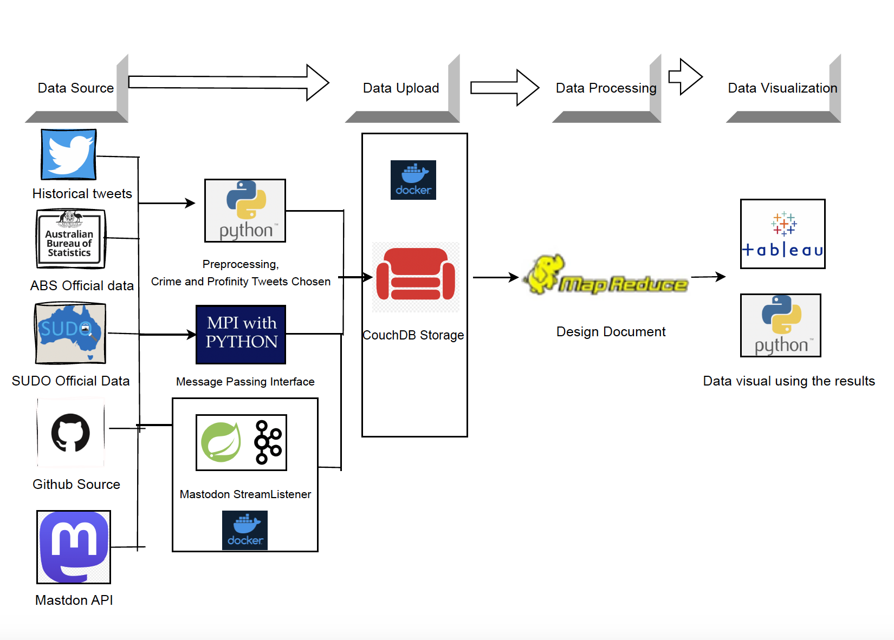
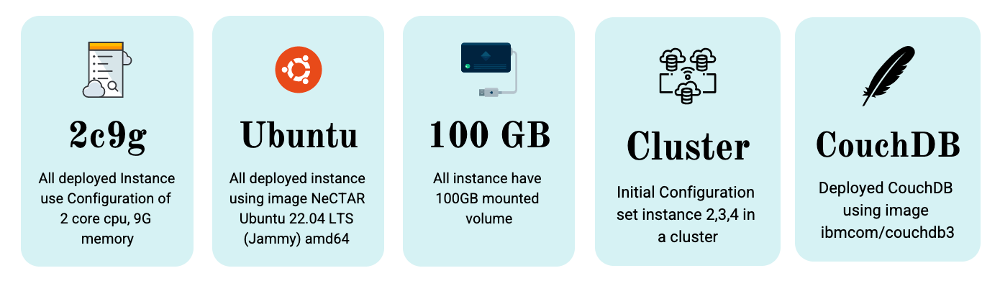
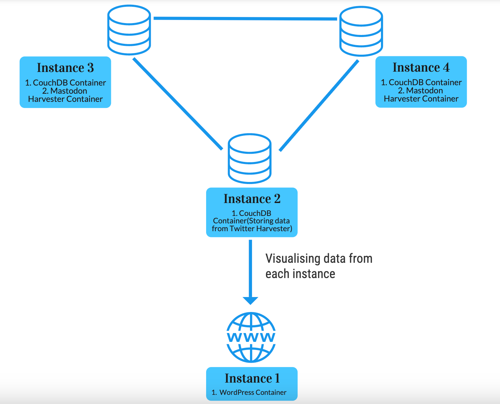

# Social Media Analytics on the Cloud

A comprehensive cloud computing project for real-time social media data collection, processing, and analysis using distributed systems and big data technologies.

## Project Overview

This project implements a scalable cloud-based system for social media analytics, featuring real-time data harvesting, distributed processing, and interactive visualization. The system combines cloud infrastructure, containerized services, and big data processing techniques to analyze social media trends and sentiment.

## Key Features

- **Real-time Data Harvesting**: Automated collection from Mastodon and Twitter APIs
- **Distributed Processing**: MapReduce-based analysis for large-scale data processing
- **Cloud Infrastructure**: Scalable deployment using Docker containers and Ansible
- **Interactive Visualization**: Web-based dashboard for data exploration
- **Topic Modeling**: LDA-based sentiment and topic analysis
- **Automated Monitoring**: Disk usage monitoring and error handling
# Getting Started
Before getting start, ensure you read the `requirements.txt` , and have necessary package
In planning stage, our initial deployment were planned as following picture:

# 1. Creating an Instance in your Cloud
In planning stage, the deployment of instance use following configuration:

First, navigate to the `ansible & docker/deploy_instance` directory.
```
cd ansible & docker/deploy_instance
```
Follow the instructions outlined in the README within this directory to create your instance.
# 2. Deploying Wordpress on your Instance
Next, navigate to the `ansible & docker/deploy_wordpress` directory.
```
cd ansible & docker/deploy_wordpress
```
# 3. Deploying the Mastodon Harvester
Once you have your instance set up with Wordpress, navigate to the `harvester (crawler)` directory.
```
cd harvester (crawler)
```
Follow the instructions in the README within this directory to deploy the Mastodon harvester.
After the deployment of above 3 stages, your node might works like below:

# 4. Deploying the Disk Usage Check Script(optional)
Finally, navigate to the `ansible & docker/error_handling` directory.
```
cd ansible & docker/error_handling
```
Follow the instructions in the README within this directory to deploy the shell script that regularly checks disk usage in your instance. If disk usage reaches 90%, the script will stop the container from collecting data to prevent overload.
# 5. Uploading the data to couchdb or creating any necessary analysis
Finally, navigate to the `data_processing_mapreduce & upload_to_couchdb` directory.
```
cd data_processing_mapreduce & upload_to_couchdb
```
Follow the instructions in the README within this directory.
# 6. Extracting the grouping data could plot the graph
navigate to the `graph_coding` directory. 
```
cd graph_coding
```
Following the readme in the folder would created the necessary data to plotting graph
# 7. LDA Model
Running from top to down of the file `Model/LDA_bad_word.ipynb` would generate the `result` file
which could visualized a cluster of topic.
# Other files
Some other folders might not documented above, and their functionality would listed below:
* `frontend` : since we using wordpress for our website application, so only the file we additionly use to produce extra functionality in website would put in here
* `SUDO_Data`: These file is for placing the file we collected from sudo
* `report`: These file would be used to placed our final report
# Acknowledgments
This program was created as a project for COMP90024 Cluster and Cloud Computing at University of Melbourne. Special thanks to teaching teams :Prof.Richard Sinnott, Researchers Yao (Alwyn) Pan, Cloud Architect Luca Morandini and other staff for their guidance and support.
