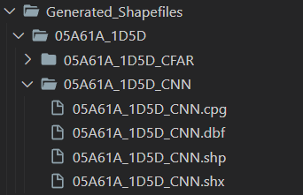

# Iceberg Detection from Satellite Imagery

**Authors**: Benjamin Fouquet, Nandi Ruan, Jiaxin Wu, Bohan Su

**Repository**: https://github.com/benjaminfouquet/IcebergDetection

## Project Overview

This project develops machine learning models for automatic iceberg detection from satellite imagery, focusing on smaller icebergs ('bergy bits') that pose significant threats to Antarctic navigation. The solution combines multiple approaches including Convolutional Neural Networks (CNN), Residual Neural Networks (ResNet), Constant False Alarm Rate (CFAR) algorithms, and ensemble methods.

## Key Achievements

- **60% F1-score** average performance across test datasets
- **Near real-time processing** capabilities
- **Multi-model ensemble** approach for improved accuracy
- **Automated shapefile generation** for GIS integration

## Technical Approach

The project implements a comprehensive pipeline combining:
- **CNN Models**: Custom convolutional neural networks for feature extraction
- **ResNet**: Pre-trained residual networks with fine-tuning
- **CFAR Algorithm**: Constant False Alarm Rate detection for radar-like processing
- **Ensemble Methods**: Voting-based combination of multiple models
- **Geospatial Processing**: Integration with SNAP and QGIS for real-world applications

## Example output.
The 'main' notebook outputs 5 shapefiles: 1 for each model (CFAR, CNN, ResNet) and 2 for the Ensemble model that combines the other models. The 2 shapefiles from the Ensemble model are the points detected by 2 models (blue) or 3 models (red). Points only detected by 1 model (green) are discarded.

## Performance of the approach.

We first notice that SNAP is the best model in most cases, while the Ensemble model is better when other models are similarly accurate (images E82B, D15B, 264D). The average F1-score of the Ensemble model is about 0.5, while that of SNAP is about 0.6. The models perform poorly when there are few icebergs and most predicted points are false positives. But even in that case points with 3 votes are close to the true icebergs. The sensitivity of the models to noise, edges and unmasked land masses is especially a problem when there are few icebergs since most of the detected icebergs will be False Positives. 

The model will still need some human validation.

## Tutorial.
### 1. Copernicus archive
Download .SAFE files from open access Copernicus archive : https://dataspace.copernicus.eu/browser.

### 2. SNAP
- Download and install: Install SNAP if it's not already installed: https://step.esa.int/main/download/snap-download/.
- Import .SAFE file: in SNAP import the product you downloaded on Copernicus.
- Open the Graph Builder and use the provided graph 'IcebergDetectionGraph':

- Make sure the selected product is correct:

- Make sure the the output name corresponds to the input image:

- Make sure the output folder is 'SNAP_Images' in the 'IcebergDetection' project:

- Run the Graph. It will take about 10 minutes.

If you had to make any changes to the Graph for it to work, make sure to save your changes.

### 3. 'Main' notebook
Once the SNAP steps are complete, in the 'main' notebook, copy the path of the output image and copy it in the input cell. 
Be sure to respect the path convention:

Run all the cells. The notebook will output shapefiles for each model:

### 4. QGIS
Human validation is still needed. You can import the generated shapefiles in QGIS (https://qgis.org/en/site/forusers/download.html) to visualize the positions of the detected objects.

## Possible problems and model short comings
For model shortcomings, see report.

Possible problems:
  - SNAP output may be too large for processing. No solution yet. Can submit .tif file from Polarview to main notebook. Performance will siginificantly decrease, Ensemble will only have 2 shp files for detection as CFAR algorithm is executed through SNAP. (Possible solution: reproduce Preprocessing and CFAR steps in Python instead of using SNAP). 